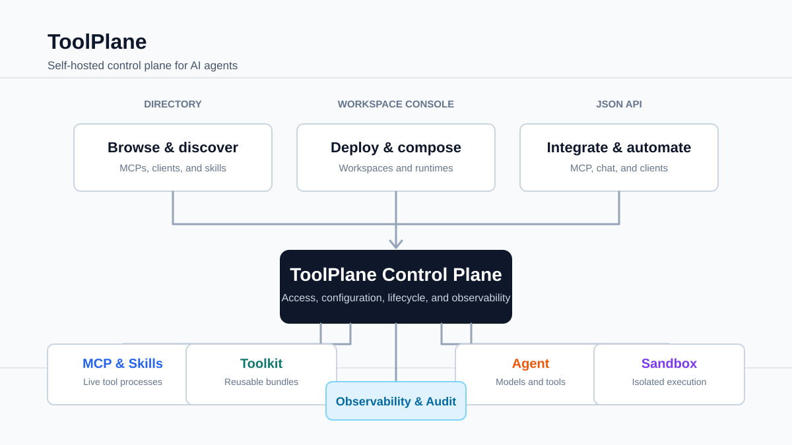
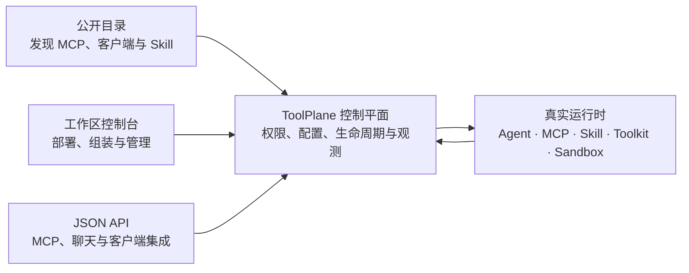

# ToolPlane

> 面向智能体工具、MCP 服务器、技能、工具包和沙箱的自托管控制平面。



ToolPlane 为每个工作区提供统一入口，用于发现、运行、组合、观测并向
Agent 挂载能力。仓库代码公开，但每个实例的凭据、工作区数据和运行时容器
始终由部署者自行保管。

## 核心能力

- 在公开目录中浏览 MCP 服务器、MCP 客户端和 Agent Skill。
- 从 npm、PyPI、GitHub 或 Docker 部署目录中的 MCP，也支持自定义 MCP。
- 将已部署的服务器和 Skill 自由组合成可复用的 Toolkit。
- 将 Toolkit 以同步的 MCP 与 Skill Bundle 安装到 Claude Code、Codex 和
  OpenCode 类客户端。
- 构建可使用模型提供商、MCP 工具、Skill、Toolkit、子 Agent 和 Sandbox 的
  Agent。
- 运行 Docker Linux 沙箱，或通过一条 WebSocket CLI 命令连接用户自己的设备。
- 观测网关调用、延迟、错误与插件同步遥测。

## 架构

一个 Next.js 应用提供三类入口：



1. **公开目录**（`src/app/(site)/**`）：无需登录即可浏览和发现能力。
2. **工作区控制台**（`src/app/app/[workspace]/**`）：管理经过身份验证的运行时。
3. **JSON API**（`src/app/api/v1/**`）：提供 MCP JSON-RPC、Toolkit Manifest、
   Connector 引导、插件同步、Skill 下载和 Agent 聊天。

运行时并非模拟实现。每个 MCP 部署都是由
`src/lib/process/supervisor.ts` 管理的真实子进程；网关会将 JSON-RPC 请求代理给
活动进程，并写入可观测性数据。

### Agent Control MCP

外部 AI 客户端可通过 Agent Control MCP 创建和运行工作区 Agent：

```text
POST /api/v1/workspaces/<workspace-slug>/agents/mcp
Authorization: Bearer <personal-api-token>
```

在控制台中打开 **Agents → Connect AI** 可复制客户端配置。此 MCP 服务提供安全的
资源发现、原子化 Agent 创建、MCP 检查和持久化消息能力，不会返回模型提供商密钥
或运行时机密。详见 [docs/AGENT_CONTROL_MCP.md](docs/AGENT_CONTROL_MCP.md)。

## 快速开始

前置条件：

- Node.js 22+
- pnpm
- Docker

```bash
cp .env.example .env
docker compose -f docker-compose.yml -f docker-compose.dev.yml up -d postgres
pnpm install
pnpm db:migrate
pnpm db:seed
pnpm dev
```

默认演示账户：

```text
smoke@example.com / password123
```

演示种子会创建 8 个停止状态的 MCP 部署，覆盖 npm、PyPI、GitHub、Docker、JSON
配置和目录关联部署；还会创建 4 个调试 Skill 与一个私有的 `Debug Starter Kit`。
该过程是确定性的，不会拉取外部 Skill 内容，也不会启动 MCP 进程。

本地应用地址：

```text
http://localhost:3000
```

## 常用命令

```bash
pnpm dev
pnpm build
pnpm lint
pnpm test
pnpm db:migrate
pnpm db:generate
pnpm db:studio
pnpm connector:dev
```

请使用 `pnpm`，仓库只提交 `pnpm-lock.yaml`。

## 用户设备连接器

用户设备上的沙箱不需要 SSH 或 Chisel。Linux、macOS、Windows PowerShell 与
Windows 命令提示符均可使用同一条命令：

```text
npx -y --no-audit --package "http://localhost:3000/api/v1/connectors/package.tgz?v=0.1.13" connector connect --server "http://localhost:3000" --token "mcpcon_..." --root "~/toolplane-sandbox" --screen-vnc "auto"
```

`--screen-vnc auto` 会暴露已经监听在 `127.0.0.1:5900` 的 VNC 服务；其他回环地址
可使用 `127.0.0.1:<port>`。浏览器的 Screen 标签使用 noVNC 并以只读方式启动。
连接器不会连接 ToolPlane 提供的任意 VNC 地址。

Android 手机通过运行连接器的电脑上的 ADB 桥接：

```text
npx -y --no-audit --package "http://localhost:3000/api/v1/connectors/package.tgz?v=0.1.13" connector connect --server "http://localhost:3000" --token "mcpcon_..." --root "/sdcard/ToolPlane" --android "auto"
```

安装 `adb` 并授权一台 USB 或无线调试设备后运行该命令。连接多台设备时，将 `auto`
替换为 ADB 序列号。Android 提供 Shell、文件、设备安装对应运行时后的结构化执行，
以及只读屏幕快照。

沙箱页面生成 `mcpcon_...` Token，数据库中只保存其哈希值。引导流程会提供配置好的
本地根目录，因此生成命令不需要对系统路径进行 Shell 转义。HTTP 引导与 WebSocket
认证都使用 Bearer Header，Token 不会出现在 URL 中。连接器建立到 ToolPlane 的
WebSocket 会话后，ToolPlane 通过该会话代理原生 Shell 执行、结构化脚本执行、文件操作
和终端流。

连接器需要 Node.js 20+、访问 ToolPlane 的 HTTP/WebSocket 端点，以及访问 npm
registry 以下载其 `ws` 和 `node-pty` 依赖。Windows 支持 Windows 10 1809 及更高版本
和 Windows 11 的 x64/arm64。如果 PowerShell 策略拦截 `npx.ps1`，请在命令提示符中
运行同一命令。连接器以启动它的本地用户权限运行；处理不可信 Agent 工作负载时应使用
低权限专用账户。连接器协议升级后，请停止旧进程并重新生成命令运行新版本；不兼容的
旧客户端会被刻意拒绝。

## 部署说明

ToolPlane 应作为单个持续运行的 Node 进程部署，因为 MCP 与 Sandbox 部署由内存中的
监督器管理。请使用 VM、VPS 或容器宿主机，不要部署到 Serverless 平台。

Docker Compose 会运行 Postgres、受限的 Docker Socket 代理，以及来自 GHCR 的预构建
应用镜像：

```bash
docker compose pull app
docker compose up -d
```

Compose 默认将应用发布到宿主机 `10030` 端口，将 Connector WebSocket Broker 发布到
`9321` 端口。端口冲突时可覆盖 `APP_HOST_PORT` 或 `CONNECTOR_WS_HOST_PORT`；使用
`APP_HOST_BIND` 与 `CONNECTOR_WS_HOST_BIND` 绑定指定网卡。反向代理位于另一台机器时，
应仅允许该代理主机访问 Broker 端口。

需要固定版本时，设置 `TOOLPLANE_IMAGE`，例如
`ghcr.io/asharca/toolplane:sha-dc33d7f`。已发布部署镜像为 `linux/amd64`，服务器部署时
`TOOLPLANE_PLATFORM` 默认使用该平台。

### 公网 URL、TLS 与邮件

对外提供服务前，请将 `NEXT_PUBLIC_APP_URL` 设置为唯一的 HTTPS 公网地址。在反向代理
处终止 TLS，并转发原始主机名和协议 Header。如果同时存在根域和 `www` DNS 记录，请为
两者提供有效证书并将其中一个重定向到另一个；否则删除未使用的记录，避免它返回代理的
默认证书或错误页。

密码恢复使用 `SMTP_URL` 和 `SMTP_FROM`。实例有意不配置出站邮件时，管理员可以通过
以下命令签发随机临时密码，并使现有浏览器会话失效：

```bash
pnpm account:reset-password -- user@example.com
```

ToolPlane 对密码恢复请求施加小型进程内突发限制。环境变量
`TOOLPLANE_PASSWORD_RESET_GLOBAL_LIMIT` 控制十分钟内的实例级上限（默认 `200`）；
它只是单进程保护，不能替代边缘限流器。反向代理还应对登录、注册和密码恢复的 Server
Action 限流，并在转发给应用前替换而非追加客户端提供的 `X-Forwarded-For` /
`X-Real-IP` Header。

应用镜像包含用于 Docker 来源 MCP 部署的 Docker CLI。它仅通过受限 Socket Proxy 与
Docker 通信，因此必须保持该代理仅在 Compose 网络内可见。

### MCP 启动超时

从 npm、PyPI 或 GitHub 安装自定义 MCP 时，首次下载依赖可能长时间没有输出。Compose
提供 `TOOLPLANE_MCP_STARTUP_IDLE_TIMEOUT_MS`（默认 `300000`，5 分钟）和
`TOOLPLANE_MCP_STARTUP_MAX_TIMEOUT_MS`（默认 `900000`，15 分钟）作为启动看门狗。
两者单位均为毫秒，最大值必须不小于空闲值。可在 `.env` 中修改并重新创建或部署应用，
也可在 **Admin → Settings** 中保存覆盖值，使其在下一次 MCP 启动或重启时生效。管理员
覆盖值优先于环境变量；在同一页面重置后会恢复 Compose 设置。

管理员可从工作区侧边栏、ToolPlane 标志下方更新已部署实例。更新操作会检查最新 GitHub
Release，下载 `TOOLPLANE_UPDATE_ARTIFACT`（默认
`toolplane-runtime-linux-amd64.tar.gz`），验证 `.sha256` 资产，原地替换 `/app` 中的
运行时文件并退出 Node 进程。HTTP 操作会启动后台任务并在下载前返回 `202 Accepted`，
避免反向代理超时将已成功的重启误报为 `502`。浏览器会轮询任务和新进程标识，直到目标版本
开始提供流量。Docker 或 Coolify 随后通过 `restart: unless-stopped` 重启同一容器，因此
更新器不依赖平台生成的容器名称。

发布 `v*` 标签会同时发布 GHCR 镜像和自更新运行时资产。

消息渠道使用 Cherry Studio 的原生 Node 传输实现 Telegram、飞书、QQ、微信、Discord 和
Slack。包括 `pnpm dev` 在内，无需 Hermes Checkout 或 Python 渠道运行器。渠道按 Sandbox
配置，迁移到另一个工作区 Sandbox 时无需重新输入凭据。

本地调试时，在主 Compose 文件之上叠加 `docker-compose.dev.yml`，即可在
`127.0.0.1:5433` 暴露 Postgres，并在应用运行于 Docker 时暴露 Connector Broker 端口。

## GitHub 配置

建议的仓库设置：

- 保护 `main`：要求 PR 保持最新，管理员也不例外。
- 必需检查：`validate`、`connector (ubuntu-latest)`、
  `connector (macos-latest)` 和 `connector (windows-latest)`。
- Secrets：部署凭据、镜像仓库凭据与生产环境变量。

完整 CI 在 PR 或手动触发时运行，合并到 `main` 后不会重复运行。共享的 `@asharca/ui`
包由 `asharca/ui` 维护；ToolPlane 使用已发布的 npm 版本。详见
[UI 与 CI 工作流](docs/UI_LIBRARY.md)。

仓库简介：

```text
ToolPlane：面向智能体工具、MCP 服务器、技能、工具包和沙箱的自托管控制平面。
```

## 参考资料

- 深入架构说明：[docs/ARCHITECTURE.md](docs/ARCHITECTURE.md)
- Sandbox 与连接器设计：[docs/SANDBOXES.md](docs/SANDBOXES.md)
- Toolkit 同步设计：[docs/TOOLKIT_SYNC.md](docs/TOOLKIT_SYNC.md)
- Agent Control MCP：[docs/AGENT_CONTROL_MCP.md](docs/AGENT_CONTROL_MCP.md)
