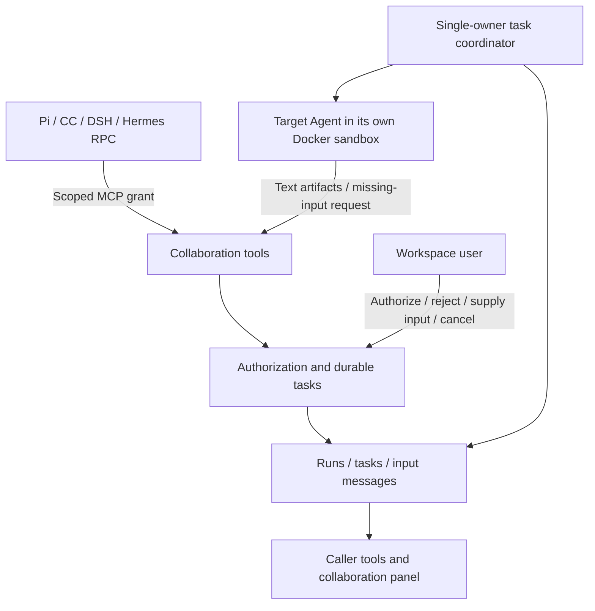
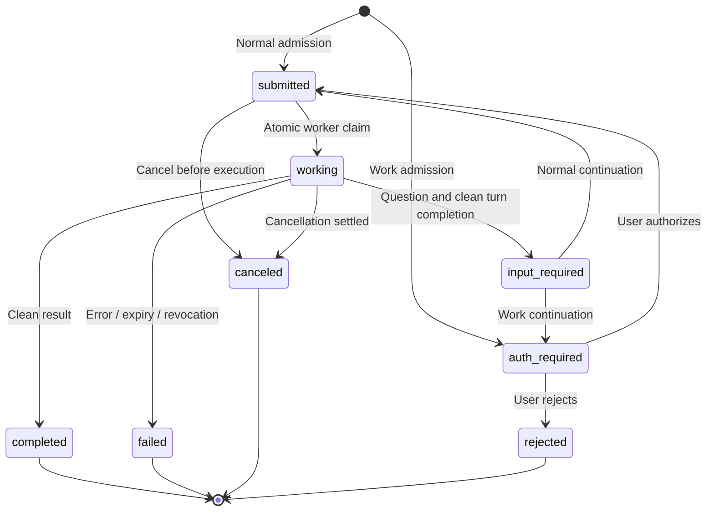

# Agent collaboration

> **中文**：[AGENT_COLLABORATION.zh-CN.md](./AGENT_COLLABORATION.zh-CN.md)

This guide covers ToolPlane's internal task-based collaboration for Pi, Claude Code, DSH and Hermes RPC. It is for Agent operators and developers implementing delegation, authorization or runtime adapters. The original managed `hermes` runtime is not changed or enabled by this feature.

## Start with an allowed relationship

Configure the target Agent's model, exclusive Docker sandbox, MCP deployments and Skills. In the caller's **Settings → Sub-agents**, select the targets it may invoke. This relationship authorizes access to the target's configured capabilities; do not bind an Agent whose resources should not be available through delegation.

A normal chat, message-service or Work execution with selected targets receives a `toolplane-collaboration` MCP server automatically. No personal API token needs to be copied into a sandbox. Inspect tasks in the caller's **Settings → Agent collaboration**. The root caller's panel also includes nested tasks; it displays the latest 50 tasks, with nested lookup limited to the latest 100 root runs.

Work-origin tasks start at `auth-required`. An authenticated workspace user must explicitly authorize that task in the panel after reviewing the target configuration. Approval permits the target to use its configured native tools, MCP, Skills and sandbox; it is **not per-tool approval**. Subsequent missing-input continuations require fresh authorization. The model cannot approve itself. Legacy nested host tools remain disabled in Work.

## Protocol boundary

The task, message, context and artifact separation is inspired by [A2A](https://a2a-protocol.org/latest/specification/). The implemented transport is standard [MCP tools](https://modelcontextprotocol.io/specification/2025-11-25/server/tools) with ToolPlane-specific tool names and schemas. `protocolVersion: "1.0"` inside a task is the **internal task contract**, not an A2A protocol-version claim.

This release does **not** implement A2A Agent Cards, A2A wire methods, external Agent discovery/client calls, webhooks, SSE task subscriptions or experimental MCP Tasks. Do not advertise these capabilities. The service/transport split permits a later standards-conformant A2A adapter without duplicating task authorization and persistence.



## Tools

| Tool | Purpose |
|---|---|
| `list_delegate_agents` | List only currently bound targets within the signed execution's allowlist; no prompts or credentials |
| `delegate_to_agent` | Submit a task with `agentId`, a unique `messageId`, and `message`; return its actual state, not presumed success |
| `get_delegation` | Read a task; optional `waitSeconds` waits up to 20 seconds for a change |
| `continue_delegation` | Supply missing information with a new `messageId`; reuse the existing task/context only while `input-required` |
| `cancel_delegation` | Request cancellation of a task and descendants |
| `get_current_delegation` | Read the task assigned to this execution, if any |
| `request_delegation_input` | Record a question; the target must then finish its turn |
| `publish_delegation_artifact` | Publish a bounded, named text artifact; not an arbitrary path/URL upload |

Example arguments for `delegate_to_agent` (use an ID returned by discovery):

```json
{
  "agentId": "reviewer-agent-id",
  "messageId": "review-request-001",
  "message": "Review the supplied patch for authorization errors and return a report."
}
```

Transport is `POST /api/v1/agent-runtime/collaboration/<runId>/mcp`, injected by the runner. It accepts a signed runtime grant carrying that exact `collaborationRunId`, not a session cookie, personal token or Toolkit token. MCP uses JSON-RPC `initialize`, `ping`, `tools/list`, `tools/call` and notifications. Notification requests cannot mutate tasks. Application failures return `isError: true`, not successful prose pretending that an error was a result.

## Tasks and contexts

Each accepted task owns a separate target Conversation/native-session identity. The caller supplies only its explicit task message; the service does not copy the caller's full history, credentials or filesystem. Native session persistence follows the target runtime's adapter. The legacy `runAgentTurn()` text-returning helper remains separate.



Diagram identifiers `auth_required` and `input_required` correspond to the wire values `auth-required` and `input-required`. Waiting states can also expire or be canceled. `completed`, `failed`, `canceled` and `rejected` are terminal: follow-up work requires a **new task**, not restarting a completed one.

A missing-input request is committed only after clean native completion. It is not a native approval/clarification bridge and must not convert a timeout or crash into a successful suspension. Text artifacts may be recorded before completion; inspect the task state before treating them as final deliverables.

`messageId` deduplicates submissions within caller Agent + caller Conversation. Reusing an ID with changed target/content returns conflict. The same conversation can retrieve its prior accepted tasks during a later authorized turn; another conversation cannot. Continuation IDs deduplicate within the task. IDs are not access credentials.

Accepted tasks may continue after the caller **successfully** ends its turn. Results do not automatically wake the caller or append a new parent reply. Read the panel, or ask the caller to retrieve its task during its next turn in the same conversation. Cancellation/failure of an execution cancels its accepted descendants; canceling or failing the originating Work also revokes ongoing collaboration. A Work that merely completed its source turn is not equivalent to canceling its separately authorized tasks.

## Authorization, limits and failure handling

The service derives caller, workspace, chain, root execution and deadline from signed grants and database state. Model arguments cannot set these fields. Admission intersects the execution snapshot with the current `AgentSubAgent` edge; removing the edge also revokes runtime access to results. Targets use their own granted resources, not an automatic copy of the caller's permissions. Public hidden runtimes and the old managed Hermes are not collaboration targets.

A target configuration fingerprint is rechecked before execution and completion, and during active-worker checks. Changing the model/resource bindings invalidates an accepted task rather than broadening its authority silently. Explicit user decisions are audited without copying task content. Work authorization is invalidated if the approving user loses workspace access. This is not a promise of revoking an external side effect that already happened.

| Bound | Current implementation |
|---|---|
| Delegation depth | At most 3 edges from the root caller; cycle detection uses the server-owned chain |
| Admissions per root run | 16 tasks, including canceled/rejected tasks; no refund-based retry loop |
| Active tasks | 8 per workspace; 2 coordinator executions per delegation depth, at most 6 total and one per target |
| Deadline | 30 minutes for a root execution; descendants inherit it, including input/authorization waiting |
| Input messages | At most 8 per task; each message at most 32,768 UTF-8 bytes |
| Results | At most 65,536 UTF-8 bytes |
| Text artifacts | At most 8 per task, each at most 16,384 UTF-8 bytes |
| Transport | 65,536-byte request body; 120 requests/minute per execution grant; bounded polling |

These are execution/admission bounds, **not a shared dollar or exact token budget**. Worker capacity is reserved per depth and deeper queued tasks are prioritized, so first-level waiting parents do not occupy their children’s slots. Use bounded waiting; mutually busy target Agents and arbitrary externally orchestrated workflows still require deadline/cancellation handling. This is not a distributed workflow scheduler.

Cancellation first sets `cancelRequested`; a working task reaches `canceled` only after its execution settles. Running operations are registered with the single runtime owner; shutdown stops admission, aborts workers and drains tracked work. Following restart, previously `working` tasks become `failed` with `interrupted`, rather than replaying possibly completed side effects. Still-queued tasks are revalidated before execution. There is no transparent retry of native execution.

Normal expired terminal trees and their private target Conversation records are pruned after seven days in bounded hourly batches. Caller conversations are preserved. Native state/files remain under sandbox lifecycle management. Removing an Agent can cascade task records; remaining target conversations/native files follow their existing lifecycle rather than being deleted by guessed paths. Backups need their own retention policy.

## Source map, verification and deployment

| Responsibility | Source |
|---|---|
| Schemas, tool catalog and limits | [`collaboration/protocol.ts`](../src/lib/agents/collaboration/protocol.ts) |
| Durable admission, ownership, input, decisions and artifacts | [`collaboration/service.ts`](../src/lib/agents/collaboration/service.ts) |
| Execution, cancellation, recovery and retention | [`collaboration/worker.ts`](../src/lib/agents/collaboration/worker.ts) |
| MCP dispatch | [`collaboration/mcp.ts`](../src/lib/agents/collaboration/mcp.ts) |
| Runtime bridge and signed grants | [`sandbox-turn.ts`](../src/lib/agents/sandbox-turn.ts), [`runtime-access.ts`](../src/lib/agents/runtime-access.ts), [`runtime-grant.ts`](../src/lib/agents/runtime-grant.ts) |
| User review panel | [`AgentCollaborationPanel.tsx`](../src/components/dashboard/agents/AgentCollaborationPanel.tsx) |

Apply `20260918000000_agent_collaboration` and generate Prisma Client before starting this version, using the [single-owner upgrade procedure](./RUNTIME_OPERATIONS.md). It adds three tables and their indexes/relations; it does not migrate old Hermes volumes or old conversations.

Run `pnpm vitest run tests/unit/agent-collaboration*.test.* tests/integration/agent-collaboration.test.ts`. Integration tests require an isolated Postgres database; the real concurrent-admission test is deliberately skipped with `TOOLPLANE_TEST_PGLITE=1`. Do not use embedded-database results as evidence of PostgreSQL locking correctness. Ordinary CI tests use fake native execution, not live model-provider keys or actual cross-CLI end-to-end runs.

The user API is `/api/v1/workspaces/<slug>/agents/<agentId>/collaboration`: authenticated GET for tasks and same-origin session POST for `approve`, `reject`, `continue`, `cancel`. Personal tokens are permitted under normal account authorization; Toolkit/runtime tokens are not. Binary artifacts, external A2A interoperability, native per-tool interaction bridging and automatic parent resumption remain separate capabilities, not implied by this release.
