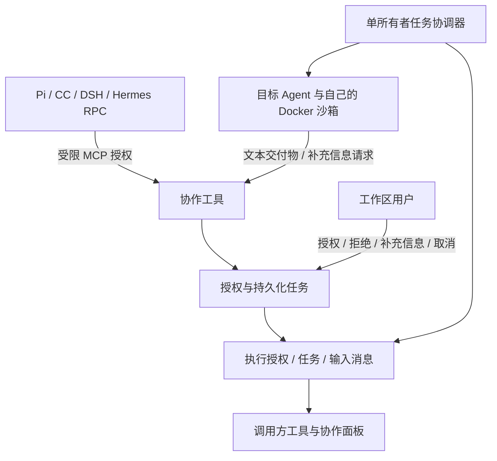
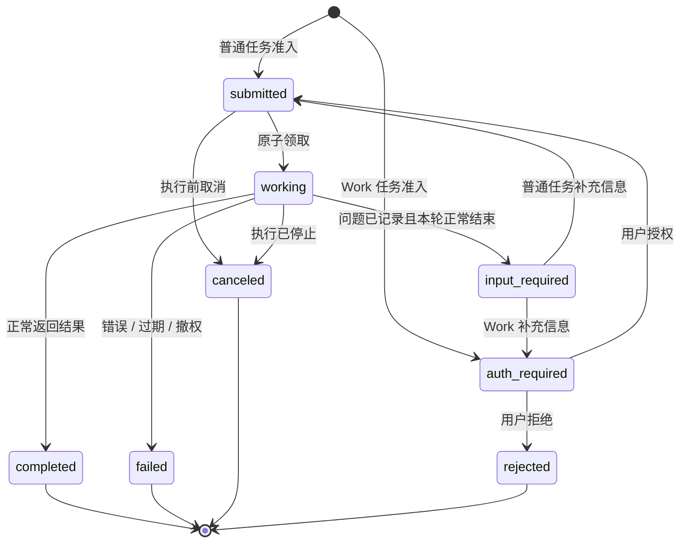

# Agent 间协作

> **English**: [AGENT_COLLABORATION.md](./AGENT_COLLABORATION.md)

本文面向 Agent 配置人员和维护委派、授权、运行时适配的开发者，说明 Pi、Claude Code、DSH 和 Hermes RPC 的平台内部任务协作。原有 `hermes` 托管模式不因本功能被修改或自动开放协作。

## 从允许的关联开始

先配置目标 Agent 的模型、独占 Docker 沙箱、MCP 和 Skill，再在调用方的 **设置 → 子 Agent** 中选择允许委派的对象。这一关联意味着目标配置的能力可以通过委派使用，不要绑定不应向调用方开放资源的 Agent。

普通聊天、消息服务或 Work 执行时，已关联目标的调用方会自动获得 `toolplane-collaboration` MCP，无需把个人 API Token 放进沙箱。在调用方 **设置 → Agent 协作** 查看任务；根调用方也能查看嵌套任务。面板显示最近 50 条任务，嵌套查询覆盖最近 100 个根执行。

Work 发起的任务先进入 `auth-required`。工作区内经过认证的用户需检查目标配置后，明确授权该任务。授权允许目标使用其配置的原生工具、MCP、Skill 和沙箱，**不是逐个原生工具调用的审批**；补充信息继续执行时需重新授权。模型不能自行批准。Work 原有的宿主嵌套工具限制仍保留。

## 协议边界

任务、消息、上下文和交付物的划分参考 [A2A](https://a2a-protocol.org/latest/specification/)。实际传输使用标准 [MCP 工具](https://modelcontextprotocol.io/specification/2025-11-25/server/tools)，工具名称和参数是 ToolPlane 的内部契约。任务中的 `protocolVersion: "1.0"` 是**内部任务版本**，不表示 A2A 协议版本。

本版**没有**实现 A2A Agent Card、A2A 标准网络方法、外部 Agent 发现或调用、Webhook、SSE 任务订阅，以及实验性的 MCP Tasks。不能对外声明这些能力。协作服务与传输层分开，便于后续添加符合标准的 A2A 适配器，而不重复实现授权和持久化。



## 工具

| 工具 | 用途 |
|---|---|
| `list_delegate_agents` | 只列出签名执行允许清单内、当前仍有关联的目标；不返回提示词或凭据 |
| `delegate_to_agent` | 以 `agentId`、唯一 `messageId` 和 `message` 提交任务，返回实际状态，不预先宣称完成 |
| `get_delegation` | 查看任务；可用 `waitSeconds` 最多等待 20 秒的状态变化 |
| `continue_delegation` | 使用新 `messageId` 补充信息；只有 `input-required` 状态可继续同一任务与上下文 |
| `cancel_delegation` | 请求取消任务及其后代 |
| `get_current_delegation` | 读取当前执行被分配的任务，没有时返回空 |
| `request_delegation_input` | 记录需要补充的问题，随后目标应结束本轮 |
| `publish_delegation_artifact` | 发布有大小限制的具名文本交付物，不接受任意路径或 URL 上传 |

`delegate_to_agent` 参数示例，Agent ID 应使用发现接口返回的值：

```json
{
  "agentId": "reviewer-agent-id",
  "messageId": "review-request-001",
  "message": "检查提供的补丁是否存在授权问题，并返回审查报告。"
}
```

传输入口是执行器注入的 `POST /api/v1/agent-runtime/collaboration/<runId>/mcp`，要求签名运行凭据的 `collaborationRunId` 与 URL 完全对应，不接受 Cookie、个人 Token 或 Toolkit Token。MCP 支持 JSON-RPC 的 `initialize`、`ping`、`tools/list`、`tools/call` 和通知；通知不能修改任务。业务失败返回 `isError: true`，不会把错误文字包装为成功结果。

## 任务与上下文

每个接受的任务拥有独立的目标 Conversation 和原生会话身份。只传递明确的任务消息，不自动复制调用方全部历史、凭据或文件系统。原生状态恢复由目标运行时负责，旧的 `runAgentTurn()` 文本返回辅助函数与本链路分开。



图中的 `auth_required`、`input_required` 对应实际值 `auth-required`、`input-required`。等待状态也可能过期或被取消。`completed`、`failed`、`canceled`、`rejected` 都是终态；后续修改要创建**新任务**，不能重启终态任务。

补充信息请求只有在原生执行正常结束后才提交为等待状态。它不是原生审批或澄清 UI 桥接，不能把超时、崩溃伪装成成功暂停。文本交付物可以在执行中记录，判断最终结果时仍需查看任务状态。

`messageId` 在“调用方 Agent + 调用方 Conversation”范围去重；相同 ID 搭配不同目标或内容会冲突。同一会话的后续已授权执行可以读取之前接受的任务，其他会话不能读取。继续任务的消息 ID 在任务内去重。知道 ID 不等于获得权限。

调用方**成功结束**本轮后，已接受任务可以继续执行。结果不会自动唤醒调用方，也不会自动追加父对话回复；可以查看面板，或在同一对话下一轮让调用方读取结果。调用方执行取消或失败会取消它已提交的后代；原 Work 被取消或失败也会撤销持续协作。Work 只是正常结束源轮次，不等于取消已经单独授权的任务。

## 授权、限制与失败处理

调用方、工作区、调用链、根执行和截止时间均来自签名凭据与数据库，模型参数不能指定。准入同时检查执行时的允许清单和当前 `AgentSubAgent` 关联；移除关联也会撤销运行时对结果的访问。目标使用自己的授权资源，不自动继承调用方全部权限。隐藏的公共运行实例和旧托管 Hermes 不能作为本版目标。

目标配置指纹在开始执行、发布结果前以及运行期间检查。模型或资源绑定变化会让已接受任务失效，而非静默扩大能力。显式用户授权或拒绝在同一事务内审计，不复制任务内容；授权用户失去工作区访问后，Work 任务授权也失效。这不代表已发生的外部副作用可以被撤销。

| 限制 | 当前实现 |
|---|---|
| 委派深度 | 从根调用方最多 3 条委派边；循环检查使用服务端调用链 |
| 根执行准入 | 最多 16 个任务，取消或拒绝不返还额度，避免反复重试绕过 |
| 活跃任务 | 每工作区最多 8 个；每个委派深度最多 2 个协调器执行，总计最多 6 个，同一目标最多占一个槽 |
| 截止时间 | 根执行 30 分钟，后代继承，补充信息和授权等待也计时 |
| 输入消息 | 每任务最多 8 条，每条最多 32,768 UTF-8 字节 |
| 最终结果 | 最多 65,536 UTF-8 字节 |
| 文本交付物 | 每任务最多 8 个，每个最多 16,384 UTF-8 字节 |
| 传输 | 请求体最多 65,536 字节；每执行每分钟最多 120 次请求；查询使用有界等待 |

这些是任务数量、执行与准入边界，**不是统一的金额或精确 Token 预算**。执行容量按深度预留，并优先调度更深层任务，避免首层父任务占满子任务需要的槽位。仍应使用有界等待；目标 Agent 忙碌或外部编排造成的相互等待需由截止时间和取消处理。本服务不是分布式工作流调度器。

取消先设置 `cancelRequested`；运行中的任务必须等执行结束后才变为 `canceled`。整个任务登记到单运行时所有者，停机先停止接单，再中止并排空受管操作。重启后此前 `working` 的任务会以 `interrupted` 进入 `failed`，不自动重放可能已发生的副作用；仍在排队的任务执行前重新校验，没有透明重试原生执行。

正常过期且已终结的任务树及其私有目标 Conversation 在七天后按小时有限批次清理，调用方对话保留。原生会话和文件仍由沙箱生命周期管理。删除 Agent 可能级联删除任务记录；残留的目标对话或原生文件遵循原有生命周期，不根据猜测的路径删除。备份需要单独配置保留策略。

## 源码、验证与部署

| 职责 | 源码 |
|---|---|
| 参数、工具目录和限制 | [`collaboration/protocol.ts`](../src/lib/agents/collaboration/protocol.ts) |
| 准入、归属、消息、授权和交付物 | [`collaboration/service.ts`](../src/lib/agents/collaboration/service.ts) |
| 执行、取消、恢复和保留期 | [`collaboration/worker.ts`](../src/lib/agents/collaboration/worker.ts) |
| MCP 分发 | [`collaboration/mcp.ts`](../src/lib/agents/collaboration/mcp.ts) |
| 运行时接入与签名凭据 | [`sandbox-turn.ts`](../src/lib/agents/sandbox-turn.ts)、[`runtime-access.ts`](../src/lib/agents/runtime-access.ts)、[`runtime-grant.ts`](../src/lib/agents/runtime-grant.ts) |
| 用户审查面板 | [`AgentCollaborationPanel.tsx`](../src/components/dashboard/agents/AgentCollaborationPanel.tsx) |

启动新版前按[单所有者升级流程](./RUNTIME_OPERATIONS.zh-CN.md)应用 `20260918000000_agent_collaboration` 并生成 Prisma Client。迁移增加三张表及索引、关联，不迁移旧 Hermes 卷或历史对话。

运行 `pnpm vitest run tests/unit/agent-collaboration*.test.* tests/integration/agent-collaboration.test.ts`。集成测试要求隔离 Postgres；设置 `TOOLPLANE_TEST_PGLITE=1` 时刻意跳过真正的并发准入测试，不能用嵌入数据库结果证明 PostgreSQL 锁语义正确。普通 CI 使用替身原生执行，不使用生产模型密钥，也不等于真实四种 CLI 的端到端协作验收。

用户接口为 `/api/v1/workspaces/<slug>/agents/<agentId>/collaboration`：认证 GET 查看任务，同源 Cookie POST 执行 `approve`、`reject`、`continue`、`cancel`。个人 Token 遵循账户授权，Toolkit 和运行 Token 不可用于用户接口。二进制交付物、外部 A2A 互通、原生逐工具交互桥接和自动恢复父任务仍是独立能力，不由本版隐式提供。
