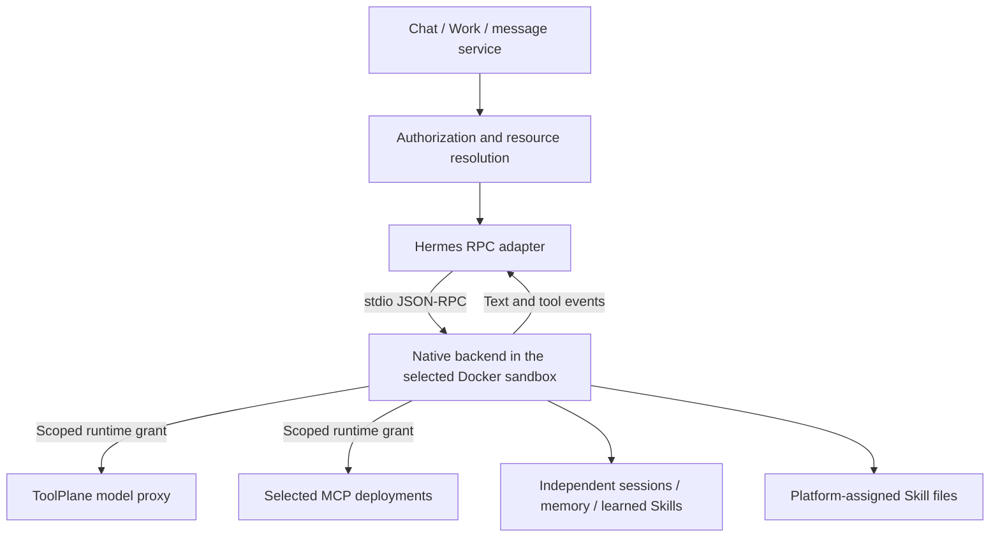

# Hermes RPC Sandbox Runtime

> **中文**：[HERMES_RPC_RUNTIME.zh-CN.md](./HERMES_RPC_RUNTIME.zh-CN.md)

This guide is for developers and operators configuring Hermes RPC. `hermes-rpc` runs the native Hermes backend in a selected ordinary Docker sandbox with platform models, MCP, Skills and Toolkits. It is independent of [managed `hermes`](./HERMES_AGENT_RUNTIME.en.md): no existing Agent is migrated, and no legacy container or `/opt/data` volume is accessed.

Platform sub-agent bindings enable the scoped collaboration MCP and durable task service. This is separate from native delegation toolsets; Work-origin tasks require explicit user authorization. [Agent collaboration](./AGENT_COLLABORATION.md).

## Usage

Choose **Hermes RPC** in **Agents → New Agent**, configure a workspace Provider, model, system prompt and step limit, and select an unassigned Docker sandbox or create a new one. MCP, Skill and Toolkit selection uses the existing resource pages; bindings can later be edited in Agent settings.

The sandbox must belong to the same workspace, be exclusive to one Agent, have network access, and provide Node.js, Git, tar, flock and Linux glibc on x64/arm64. The default Node 24 Bookworm sandbox supplies the base tools; first execution still needs GitHub and Python package-index access. Connector, Android, Windows and musl sandboxes are not supported by this mode.

| Capability | Hermes RPC | Managed Hermes |
|---|---|---|
| Persisted kind | `hermes-rpc` | `hermes`, unchanged |
| Model binding | One platform Provider + model | Existing multiple Providers / Profiles |
| Sandbox | Selected or newly created ordinary Docker sandbox | Existing dedicated Hermes resource chain |
| Tools and Skills | Platform selection, Toolkit merging, native memory and Skill tools | Existing projection and native capabilities |
| Entry points | Chat, Work, message service, one-shot sub-Agent delegation | Unchanged |
| Native commands | `/compact [focus]` | Unchanged |
| Dashboard, archive import, dedicated attachments, public Endpoint | Not exposed | Unchanged |
| Agent Control MCP creation | Not exposed | Existing `pi/hermes` subset |

Native tools and Skills can read ordinary sandbox files; that does not enable the managed-Hermes attachment-upload API. Interactive approvals and clarification are not yet bridged: such requests fail closed and end the turn. Earlier tool side effects are not rolled back.

## Execution path



[`sandbox-turn.ts`](../src/lib/agents/sandbox-turn.ts) validates the unique sandbox, workspace, networking and runtime state before issuing a grant restricted to the Provider and MCP deployments. [`hermes-rpc.ts`](../src/lib/agents/hermes-rpc.ts) prepares the pinned environment and selected Skills, generates configuration and invokes the driver. Real Provider keys remain in the platform; the sandbox receives a runtime grant, not an account or Toolkit token.

Provider formats map to `openai → chat_completions`, `openai-responses → codex_responses`, and `anthropic → anthropic_messages`. All addresses point to platform proxies; actual model behavior still depends on upstream protocol compatibility. Grants expire and are reprojected into a fresh backend on each execution, not used as permanent keys.

## Installation and ownership

[`install-hermes-rpc.mjs`](../scripts/install-hermes-rpc.mjs) verifies the SHA-256 of a pinned uv archive, checks out an immutable Hermes commit, and installs independent Python 3.13 plus the `mcp` and `anthropic` extras using `uv sync --frozen`. It does not modify application dependencies or system Python. Failed installations do not receive a success marker and may be retried. Version upgrades must update the installer, adapter and native contract checks together.

```text
/workspace/.toolplane/
  runtime-packages/hermes-rpc-<commit>/    Pinned source, Python, environment and cache
  runtimes/hermes-rpc/agents/<agentId>/
    skills/                              Platform-assigned Skills and bundle files
    home/
      config.yaml / .env                  Platform-managed configuration
      toolplane-sessions/                Platform-to-native session mapping
      state.db / memories/ / skills/     Native state and learned Skills
  runtime-tmp/                           Per-execution driver/input; cleaned on exit
```

Assigned Skills live outside Hermes home and are exposed through `skills.external_dirs`. Sync does not delete native memory or learned Skills. This is an ownership convention, not read-only isolation against a shell running inside the sandbox. Publishing a learned Skill to the platform needs separate review; shared Skills are not automatically rewritten.

The platform owns this mode's model/MCP configuration and `.env`; it does not inherit legacy Hermes Profiles, plugins or credentials. Generated configuration and inputs use private permissions. Normal exit scrubs active grants from the configuration, while abrupt termination may leave a short-lived grant file until expiration. Do not publish the whole runtime directory or native database.

## Sessions, concurrency and cancellation

[`hermes-rpc-session.mjs`](../scripts/hermes-rpc-session.mjs) calls native `session.create/resume`, `prompt.submit`, `session.compress` and `session.interrupt`. It does not scrape terminal output or invoke a nonexistent `hermes --mode rpc` flag.

Each execution starts a backend process, closes it on completion, and restores native persisted state next time. Platform history is imported only at first creation. A mapping whose native state is missing fails explicitly instead of replaying full history. One-shot sub-Agent delegation gets an independent session, never its parent's identity.

`Conversation.hermesRpcBinding` independently binds the sandbox, Provider, model and working directory without changing channel `runtimeSessionKey` or managed-Hermes session fields. Changing a binding requires a new conversation; old native files remain in their original sandbox and are not automatically moved. See [`hermes-rpc-session-binding.ts`](../src/lib/agents/hermes-rpc-session-binding.ts).

An Agent runs only one Hermes RPC operation at a time, preventing simultaneous conversations from overwriting shared configuration. [`hermes-rpc-bootstrap.py`](../scripts/hermes-rpc-bootstrap.py) also holds a process-lifetime file lock on native home. After `message.complete`, the driver waits for native idle state rather than treating returned text as proof that persistence has settled.

Timeout, cancellation, errors, limits and unsupported interactive requests never produce a success result. Prompts with possible side effects are not automatically retried. Existing Docker-process tracking and runtime-owner guards remain in force; there is no host-execution fallback.

## Tools, events and usage

[`resolveAgentTools()`](../src/lib/agents/resolve.ts) merges and deduplicates MCP and Skill bindings with existing authorization semantics. Hermes may use native `tool_search / tool_call` discovery rather than retaining every remote schema in model context. The adapter maps `mcp__<alias>__<tool>` activity back to its platform deployment.

Builtin selection is toolset-grained: disabling any file tool disables that group, and disabling either `terminal/process` disables the terminal group. Memory and session search are controlled separately. Skill tools stay enabled so an empty explicit selection cannot fall back to the default native tool inventory. Browser, media, Cron and native delegation toolsets are not enabled by default.

Text, tool activity and native usage are converted to platform events. TUI loading messages are not labeled as model reasoning; complete `session.info`, system prompts and stderr are not forwarded. Input/output usage comes from this backend's native counters; cache breakdown and exact cost are unavailable, so these values are not a billing guarantee. Missing context occupancy is not fabricated.

## Verification and deployment

```bash
pnpm vitest run tests/unit/hermes-rpc.test.ts tests/unit/hermes-rpc-session-binding.test.ts
# Optional: pinned source and its Python environment; model/MCP are local fixtures
HERMES_RPC_SOURCE=/path/to/pinned/hermes \
HERMES_RPC_PYTHONPATH=/path/to/python/site-packages \
pnpm vitest run tests/integration/hermes-rpc-native.test.ts
```

Normal CI covers protocol failure paths, configuration and existing-runtime regressions. The separate [`hermes-rpc` workflow](../.github/workflows/hermes-rpc.yml) uses an ephemeral Docker sandbox to verify cold installation, native streaming, restart/resume, grant rotation, Skill reading and MCP calls. It uses no production model keys and does not replace acceptance testing against actual models or deployment networks.

Apply `20260917010000_hermes_rpc_binding` before deployment, then generate the Prisma client and build. The migration adds one nullable field without migrating existing Agents or volumes. Follow the [single-owner upgrade procedure](./RUNTIME_OPERATIONS.md); a development branch is not an instruction to upgrade production directly.
