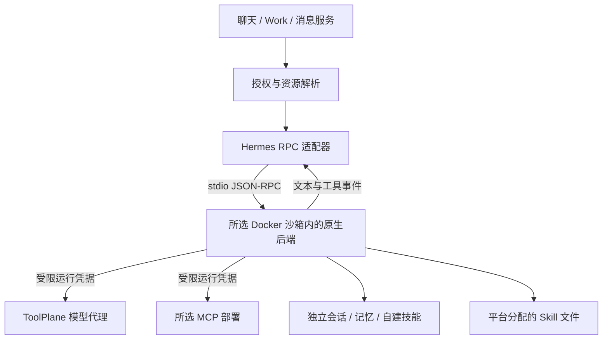

# Hermes RPC 沙箱运行时

> **English**: [HERMES_RPC_RUNTIME.md](./HERMES_RPC_RUNTIME.md)

本文面向配置或维护 Hermes RPC 的开发者与部署者。`hermes-rpc` 在所选普通 Docker 沙箱内运行 Hermes 原生后端，使用平台模型、MCP、Skill 和 Toolkit；它与原有 [`hermes` 托管模式](./HERMES_AGENT_RUNTIME.md)独立，不迁移旧 Agent，也不访问旧容器或 `/opt/data` 卷。

## 使用

在 **Agents → New Agent** 选择 **Hermes RPC**，配置工作区内的 Provider、模型、系统提示词和执行步数，再选择未分配的 Docker 沙箱或自动创建一个。MCP、Skill 和 Toolkit 使用原有资源选择页；后续可在 Agent 设置中调整。

沙箱必须同属工作区、由一个 Agent 独占、网络可达，并具备 Node.js、Git、tar、flock，以及 Linux glibc x64/arm64 环境。默认 Node 24 Bookworm 沙箱满足基础工具要求；首次执行仍需要访问 GitHub 和 Python 包索引。Connector、Android、Windows 和 musl 沙箱不在本模式的支持范围。

| 能力 | Hermes RPC | 原托管 Hermes |
|---|---|---|
| 持久化标识 | `hermes-rpc` | `hermes`，保持不变 |
| 模型选择 | 平台单 Provider + 模型 | 原有多 Provider / Profile |
| 沙箱 | 选择或创建普通 Docker 沙箱 | 原有专属 Hermes 资源链路 |
| 工具和技能 | 平台选择、Toolkit 合并、原生记忆和技能工具 | 原配置投影与原生能力 |
| 执行入口 | 聊天、Work、消息服务、单次子 Agent 委派 | 保持原入口 |
| 原生命令 | `/compact [focus]` | 保持原行为 |
| Dashboard、归档导入、专用附件、公共 Endpoint | 未开放 | 保持原行为 |
| Agent Control MCP 创建 | 未开放 | 保持原 `pi/hermes` 子集 |

普通沙箱文件可通过原生工具和 Skill 读取；这不等于支持旧 Hermes 的专用附件上传接口。交互审批与澄清暂未桥接：收到此类请求会拒绝并终止本轮，不自动批准，也不回滚此前已经发生的工具副作用。

## 执行链路



[`sandbox-turn.ts`](../src/lib/agents/sandbox-turn.ts)校验唯一沙箱、工作区、网络和运行状态，再签发限定 Provider 与 MCP 部署的运行 Token。[`hermes-rpc.ts`](../src/lib/agents/hermes-rpc.ts)准备固定版本环境和所选 Skill，生成专属配置，调用协议驱动。真实 Provider key 留在平台；沙箱收到的是本次运行授权，不是账户或 Toolkit Token。

Provider format 映射为 `openai → chat_completions`、`openai-responses → codex_responses`、`anthropic → anthropic_messages`。所有地址指向平台代理；支持的最终模型行为仍取决于上游协议兼容性。运行授权有有效期，每次执行启动新后端并重新投影，不能作为永久密钥使用。

## 安装与文件所有权

[`install-hermes-rpc.mjs`](../scripts/install-hermes-rpc.mjs)校验固定 uv 归档的 SHA-256，检出固定 Hermes commit，以独立 Python 3.13 和 `uv sync --frozen` 安装 `mcp`、`anthropic` 依赖。不修改应用依赖或系统 Python；首次安装失败不会留下成功标记，后续可以重试。升级版本需要更新安装器、适配器和原生契约测试。

```text
/workspace/.toolplane/
  runtime-packages/hermes-rpc-<commit>/    固定源码、Python、虚拟环境与缓存
  runtimes/hermes-rpc/agents/<agentId>/
    skills/                              平台分配的 Skill 与附件文件
    home/
      config.yaml / .env                  平台受管配置
      toolplane-sessions/                平台会话到原生会话的映射
      state.db / memories/ / skills/     Hermes 原生状态与自建技能
  runtime-tmp/                           本轮驱动与输入，结束后清理
```

平台 Skill 位于 Hermes home 之外，通过 `skills.external_dirs` 挂载；同步不会删除 home 内的记忆或自建技能。该目录区分是所有权约定，不是阻止沙箱内 Shell 修改文件的只读隔离。导出自建技能到平台需要单独审查，不能自动改写共用 Skill。

平台完全管理本模式的模型/MCP 配置及 `.env`，不继承旧 Hermes Profile、插件或凭据。生成配置和输入使用私有权限；正常退出会清除配置中的活动授权，异常终止可能留下尚未到期的短期授权文件。不要将运行目录或原生数据库整体公开。

## 会话、并发与取消

[`hermes-rpc-session.mjs`](../scripts/hermes-rpc-session.mjs)使用 Hermes 的 `session.create/resume`、`prompt.submit`、`session.compress` 和 `session.interrupt`，不是抓取终端文本，也不是调用不存在的 `hermes --mode rpc`。

每轮启动一个后端进程，结束后关闭，下一轮恢复原生持久化会话。平台历史只在首次创建时导入；已有映射指向的原生状态缺失时明确报错，不重放全部历史掩盖丢失。单次子 Agent 委派使用独立会话，不共享父会话 ID。

`Conversation.hermesRpcBinding` 独立绑定沙箱、Provider、模型与工作目录，不改动消息渠道的 `runtimeSessionKey` 或旧 Hermes 会话字段。改变绑定后需要新建会话；旧原生文件仍留在旧沙箱，不会自动搬迁。绑定校验见 [`hermes-rpc-session-binding.ts`](../src/lib/agents/hermes-rpc-session-binding.ts)。

一个 Hermes RPC Agent 同时只执行一个操作，避免多会话重写共用配置；[`hermes-rpc-bootstrap.py`](../scripts/hermes-rpc-bootstrap.py)还用进程生命周期的文件锁保护 native home。收到 `message.complete` 后还要等待原生状态回到 idle，不能把“已返回文本”当成会话写入完成。

超时、取消、错误、超限、未知交互请求都不会返回成功结果，也不会自动重试可能已有副作用的 prompt。平台继续使用现有的 Docker 进程追踪与单运行时所有权保护；没有宿主机执行回退。

## 工具、事件与用量

MCP 与 Skill 由 [`resolveAgentTools()`](../src/lib/agents/resolve.ts)合并、去重并保留原有授权语义。Hermes 可能通过自己的 `tool_search / tool_call` 发现与调用远端工具，不要求所有 MCP schema 常驻模型上下文。适配器映射 `mcp__<alias>__<tool>` 回平台部署。

内置工具按原生 toolset 控制：关闭一个文件工具会关闭整组文件工具，关闭 `terminal/process` 中任一个会关闭终端组；记忆与会话检索分别控制。Skill 工具保持启用，避免空 toolset 回退到原生默认全集。默认不启用浏览器、多媒体、Cron 或原生委派工具组。

文本、工具活动和原生用量转换为平台事件。不把 TUI 的加载提示当作模型推理内容，不转发完整 `session.info`、系统提示词或 stderr。输入/输出用量来自本轮后端原生计数；缺少 cache 明细和精确成本，不据此承诺精确账单。缺少有效上下文统计时不伪造占用率。

## 验证与部署

```bash
pnpm vitest run tests/unit/hermes-rpc.test.ts tests/unit/hermes-rpc-session-binding.test.ts
# 可选：固定源码与相应 Python 环境，模型/MCP 均由本地 fixture 提供
HERMES_RPC_SOURCE=/path/to/pinned/hermes \
HERMES_RPC_PYTHONPATH=/path/to/python/site-packages \
pnpm vitest run tests/integration/hermes-rpc-native.test.ts
```

普通 CI 执行协议失败路径、资源配置和旧运行时回归测试。独立的 [`hermes-rpc` 工作流](../.github/workflows/hermes-rpc.yml)在临时 Docker 沙箱中验证冷安装、原生流、重启恢复、凭据轮换、Skill 读取和 MCP 调用；不使用生产模型密钥，不替代实际模型或部署网络的验收。

部署前应用迁移 `20260917010000_hermes_rpc_binding`，它只增加一个可空字段，不迁移旧 Agent 或数据卷；之后生成 Prisma Client 并构建。遵循[单所有者升级步骤](./RUNTIME_OPERATIONS.zh-CN.md)，不要把开发分支直接当成线上升级指令。
